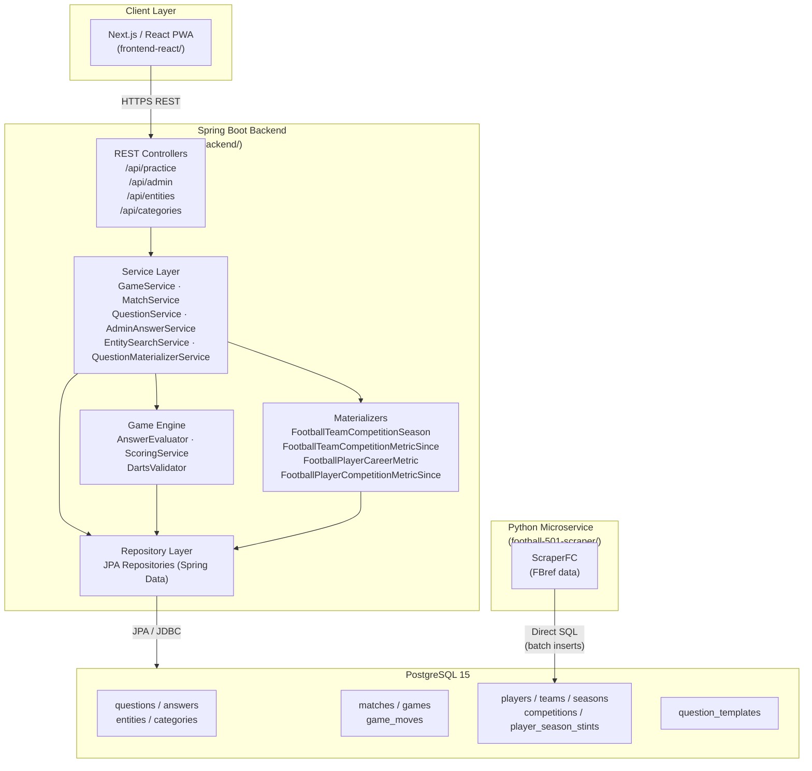
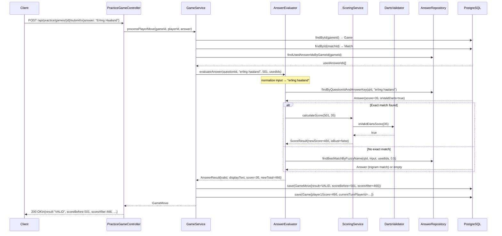
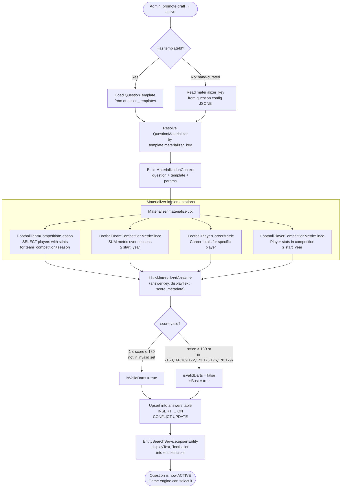
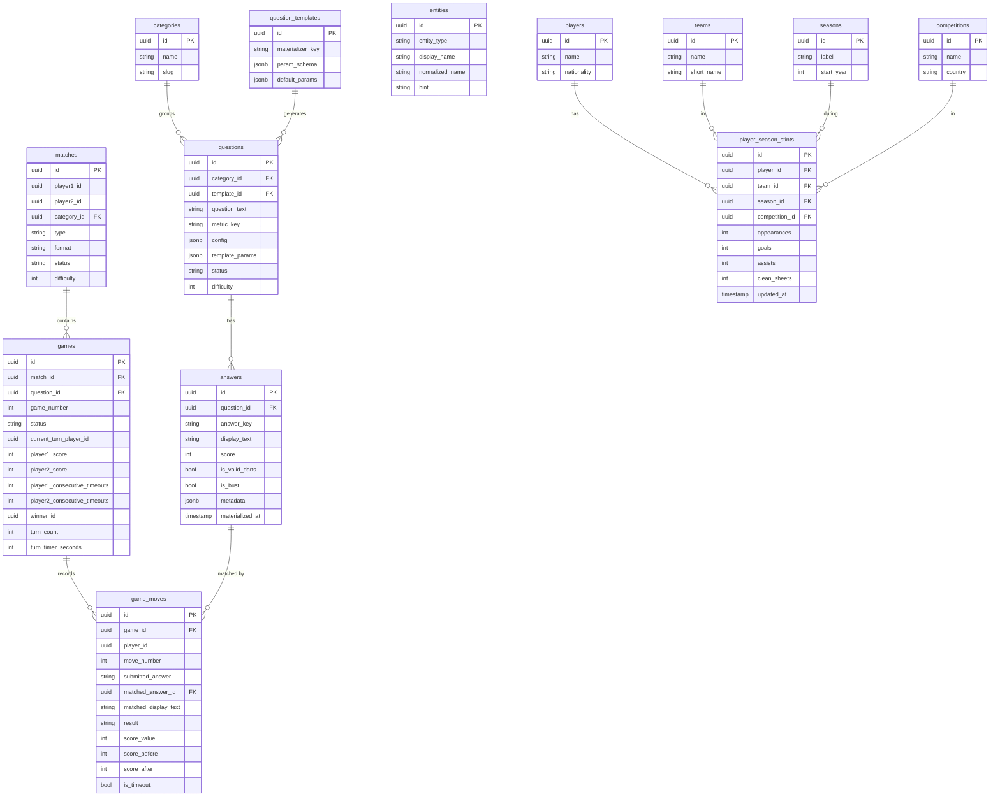
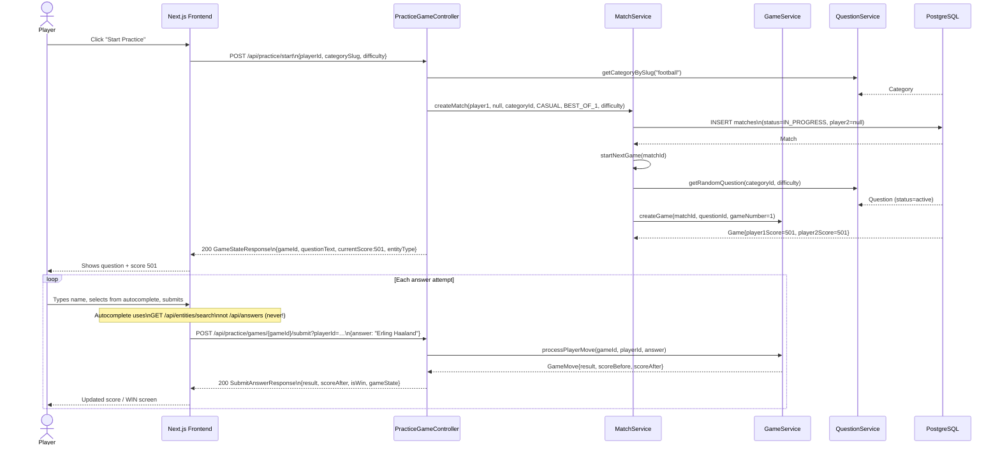
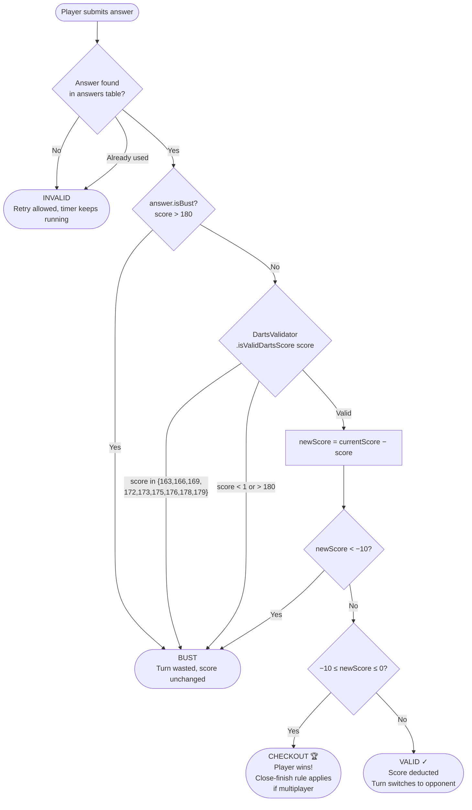
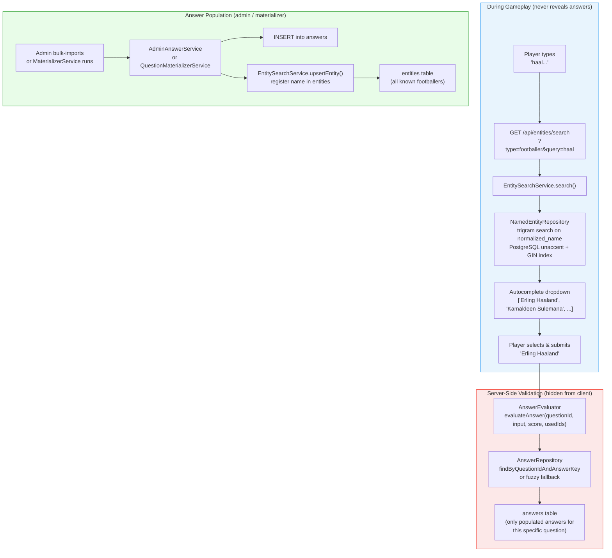

# Backend Architecture — Mermaid Diagrams

> Generated from source analysis of `backend/src/main/java/com/football501/`.  
> Spring Boot 4.x · Java 25 · PostgreSQL 15 · Flyway 12

---

## 1. High-Level System Architecture

A C4-style view of the full system. Only the backend components are currently implemented.

---

## 2. Backend Package Architecture (Layers)

Shows how the six main packages relate to each other, with their key responsibilities.

```mermaid
graph LR
    subgraph INCOMING["HTTP In"]
        REQ(("HTTP\nRequest"))
    end

    subgraph CTRL["controller/"]
        PGC["PracticeGameController"]
        AAC["AdminAnswerController"]
        AQC["AdminQuestionController"]
        ATC["AdminTemplateController"]
        ACC["AdminCategoryController"]
        AEC["AdminEntityController"]
        CC["CategoryController"]
        EC["EntityController"]
    end

    subgraph SVC["service/"]
        GS["GameService"]
        MS["MatchService"]
        QS["QuestionService"]
        AAS["AdminAnswerService"]
        ESS["EntitySearchService"]
        QMS["QuestionMaterializerService"]
        QGS["QuestionGeneratorService"]
        ACS["AdminCategoryService"]
        AQS["AdminQuestionService"]
    end

    subgraph ENGINE["engine/"]
        AE["AnswerEvaluator"]
        SS["ScoringService"]
        DV["DartsValidator\n(static utility)"]
    end

    subgraph MAT["materializer/"]
        QMI["«interface»\nQuestionMaterializer"]
        M1["FootballTeamCompetitionSeason\nMaterializer"]
        M2["FootballTeamCompetitionMetric\nSinceMaterializer"]
        M3["FootballPlayerCareer\nMetricMaterializer"]
        M4["FootballPlayerCompetition\nMetricSinceMaterializer"]
    end

    subgraph REPO["repository/"]
        AR["AnswerRepository"]
        GR["GameRepository"]
        GMR["GameMoveRepository"]
        MR["MatchRepository"]
        QR["QuestionRepository"]
        NER["NamedEntityRepository"]
        PR["PlayerRepository"]
        PSR["PlayerSeasonStintRepository"]
        TR["TeamRepository"]
        SR["SeasonRepository"]
        CR["CompetitionRepository"]
        QTR["QuestionTemplateRepository"]
        CAT["CategoryRepository"]
    end

    subgraph MODEL["model/"]
        direction LR
        MOD1["Question · Answer\nNamedEntity · Category"]
        MOD2["Match · Game · GameMove"]
        MOD3["Player · Team · Season\nCompetition · PlayerSeasonStint\nQuestionTemplate"]
    end

    REQ --> CTRL
    CTRL --> SVC
    SVC --> ENGINE
    SVC --> MAT
    ENGINE --> REPO
    MAT --> REPO
    SVC --> REPO
    QMI --> M1 & M2 & M3 & M4
    REPO --> MODEL
```

---

## 3. Game Engine — Answer Evaluation Flow

Sequence diagram for a single `POST /api/practice/games/{gameId}/submit` call.

---

## 4. Question Lifecycle — State Machine

```mermaid
stateDiagram-v2
    [*] --> draft : Admin creates question\n(or QuestionGeneratorService)

    draft --> active : Admin promotes via\nPOST /api/admin/questions/{id}/status\n\nTriggers QuestionMaterializerService.materialize()

    active --> retired : Admin retires\n(removed from game rotation;\nanswers retained for replay)

    retired --> active : Admin re-activates\n(re-materializes answers)

    draft --> [*] : Admin deletes draft

    note right of draft
        Not visible to game engine.
        No answers yet (or stale).
    end note

    note right of active
        QuestionMaterializerService
        upserts answers + entities
        before status flips.
    end note

    note right of retired
        Historical answers preserved.
        match_history still valid.
    end note
```

---

## 5. Answer Materialisation Pipeline

How a question goes from a template to a live set of game answers.

---

## 6. Core Data Model (Entity–Relationship)

Key tables and their relationships. Audit columns (`created_at`, `updated_at`) omitted for clarity.

---

## 7. Practice Game — REST API Flow

End-to-end flow from "start game" to "submit answer" for the single-player practice mode.

---

## 8. Darts Scoring Rules — Decision Tree

How `ScoringService` and `DartsValidator` decide the outcome of an answer.

---

## 9. Entity Autocomplete Architecture

How the `entities` table is kept separate from `answers` to avoid revealing valid answers during gameplay.

