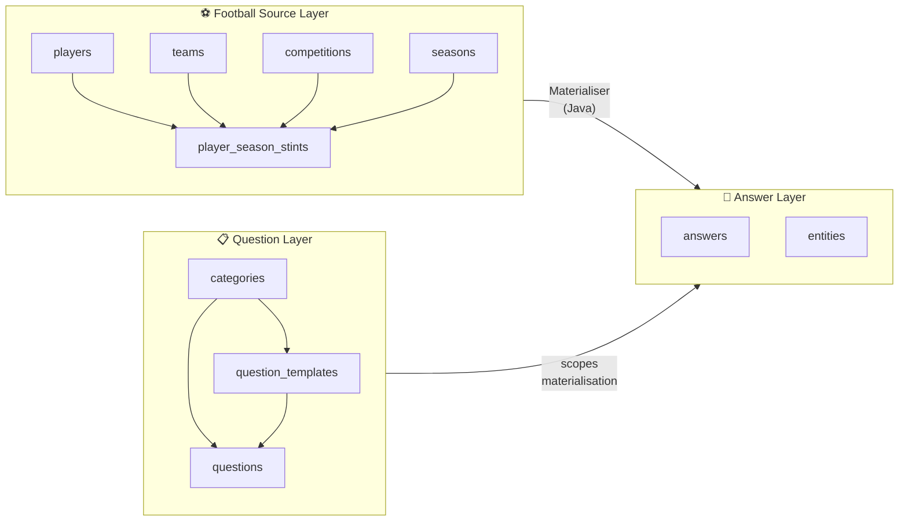
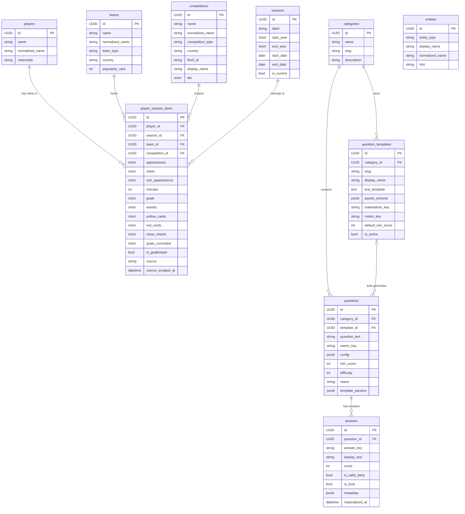
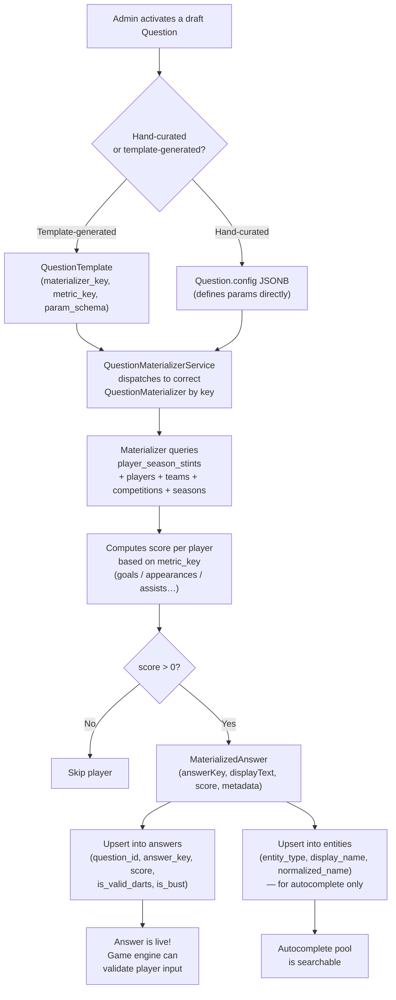
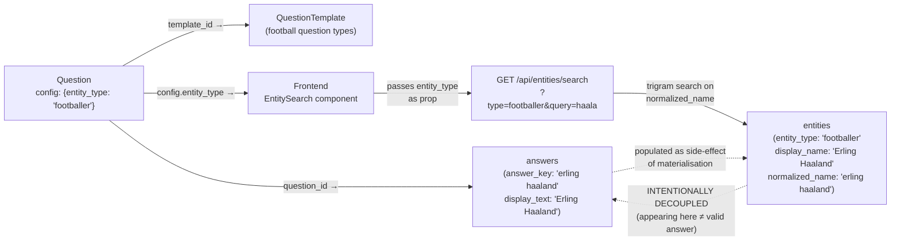
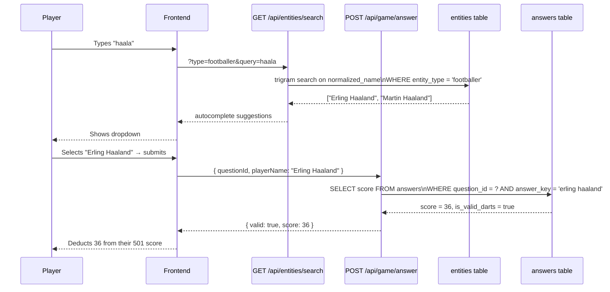

# Data Model Relationships

> **Who connects what, and why.**  
> This document explains the full chain from raw football data through to a player typing a name in-game: how `players`, `player_season_stints`, `entities`, `answers`, `questions`, and `categories` all fit together.

---

## 1. The Big Picture

There are three logically distinct layers in the system:

| Layer | Purpose | Tables |
|---|---|---|
| **Football Source Layer** | Raw scraped stats; ground truth | `players`, `player_season_stints`, `teams`, `competitions`, `seasons` |
| **Question Layer** | The game's question catalogue | `categories`, `question_templates`, `questions` |
| **Answer Layer** | Pre-materialised, game-ready answers + autocomplete | `answers`, `entities` |

The source layer feeds the answer layer via a **materialisation pipeline**. The answer layer is what the game engine touches during live play — it never reads from the source layer at runtime.

---

## 2. Full Entity-Relationship Diagram

---

## 3. The Materialisation Pipeline

This is how a row in `player_season_stints` becomes a row in `answers` (and a row in `entities`).

---

## 4. How entity_type Connects Everything

`entity_type` is the thread that ties a **question** to an **autocomplete pool** in `entities`. It is stored in `questions.config` as a JSONB key.

> **Security invariant**: `entities` is a *name pool*, not a *valid answer pool*.  
> The fact that "Erling Haaland" appears in autocomplete tells the player nothing about whether he is a valid answer to *this specific question*. All validation is done server-side against `answers` only.

---

## 5. What Connects Each Concept — Summary

| Concept | Table | Connected To | Via |
|---|---|---|---|
| **Player** | `players` | PlayerSeasonStint | `player_season_stints.player_id` |
| **Player Season Stint** | `player_season_stints` | Player, Team, Competition, Season | FK columns |
| **Entity** | `entities` | Question (indirectly) | `entity_type` slug matches `questions.config.entity_type` |
| **Answer** | `answers` | Question | `answers.question_id` |
| **Question** | `questions` | Category, Template, Answers, Entities | `category_id`, `template_id`; `config.entity_type` |
| **Category** | `categories` | Question, QuestionTemplate | `questions.category_id`, `question_templates.category_id` |

### The chain in one sentence

> A **Category** groups **Questions** (and **QuestionTemplates** that auto-generate them). A **Question** is materialised by querying **PlayerSeasonStints** (which aggregate a **Player**'s stats for a **Team** in a **Competition** during a **Season**). The materialiser writes pre-computed **Answers** (one per player, scored and darts-validated) and — as a side-effect — upserts **Entities** into the autocomplete pool, identified by the `entity_type` declared in the **Question**'s config.

---

## 6. Question Lifecycle

```mermaid
stateDiagram-v2
    [*] --> draft : Admin creates question\n(hand-curated or auto-generated\nby QuestionGeneratorService)

    draft --> active : Admin promotes\n(triggers materialisation:\nanswers + entities written)

    active --> retired : Admin retires\n(removed from rotation;\nanswers kept for replay)

    retired --> active : Admin re-activates\n(re-materialises answers)

    active --> active : Nightly stale-answer\ndetector re-materialises\nif stints updated after\nanswers.materialized_at
```

**Only `active` questions are served to players.**  
`draft` questions exist but have no answers yet.  
`retired` questions keep their `answers` rows so historical game replays remain valid.

---

## 7. Autocomplete vs. Answer Validation — Side by Side

---

*Last updated: 2026-05-26*  
*Related: [`AUTOCOMPLETE_ENTITY_DESIGN.md`](./AUTOCOMPLETE_ENTITY_DESIGN.md), [`TECHNICAL_DESIGN.md`](./TECHNICAL_DESIGN.md)*
